# Payment Setup (iOS)

<!-- Screenshots captured March 2026. RevenueCat and App Store Connect UI may differ in newer versions. -->

Step-by-step guide for configuring iOS in-app purchases with RevenueCat and App Store Connect. Covers the full setup to support monthly and annual subscriptions plus a rescue (discount) offering, as expected by Plutus hooks.

## Prerequisites

- Apple Developer Program membership with Paid Apps Agreement accepted — without this, creating IAPs fails silently
- RevenueCat account ([sign up](https://www.revenuecat.com/docs/welcome/overview))
- iOS app registered in App Store Connect (see [EAS Submit for iOS](https://docs.expo.dev/submit/ios/) if using Expo)
- Bundle identifier configured in `app.json`:
  ```json
  {
    "ios": {
      "bundleIdentifier": "com.yourcompany.yourapp"
    }
  }
  ```
- Plutus installed in your project (see [Installation](./installation.md))

## 1. Create a RevenueCat Project

Create a RevenueCat account at the [RevenueCat Overview](https://www.revenuecat.com/docs/welcome/overview). Navigate to the dashboard and create a new project. Select React Native as your platform.

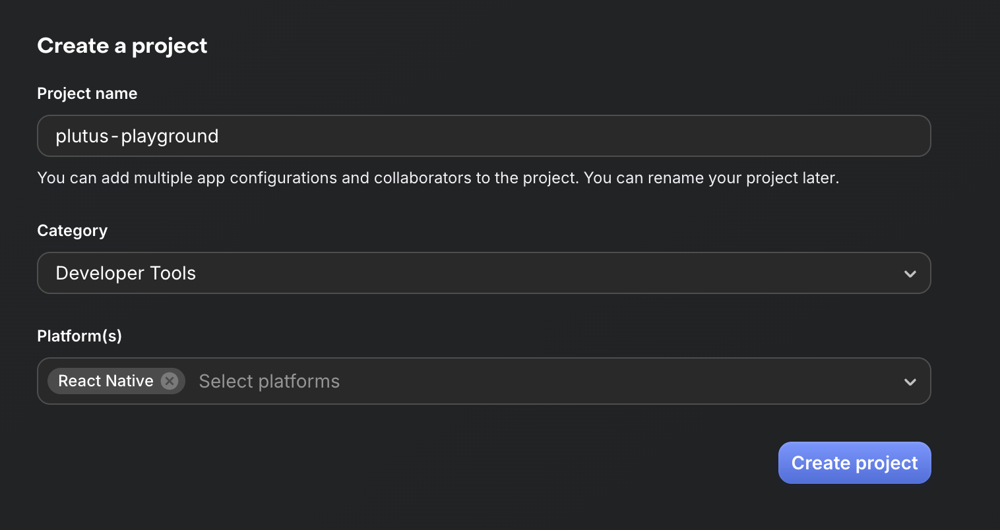

Follow the initial configuration wizard. RevenueCat suggests a default setup with a "Pro" entitlement and Monthly/Yearly packages — accept these defaults as Plutus is optimized for this model.

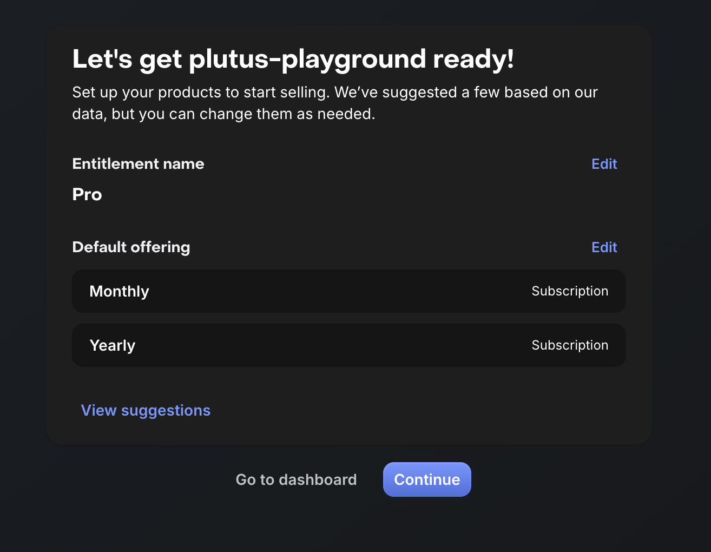

After completing the wizard, you receive a **test API key** (`test_XXXXXXX`). Save this key for development and sandbox testing without a real App Store connection.

See the [RevenueCat Quickstart](https://www.revenuecat.com/docs/getting-started/quickstart) for more details.

## 2. Register Your iOS App

You must have a real application in App Store Connect with a matching bundle ID. If using Expo and EAS, follow the [EAS Submit prerequisites](https://docs.expo.dev/submit/ios/#prerequisites), then build and submit your application.

After a successful build and submission, the app appears in App Store Connect. The RevenueCat dashboard will prompt you to configure your app for the App Store.

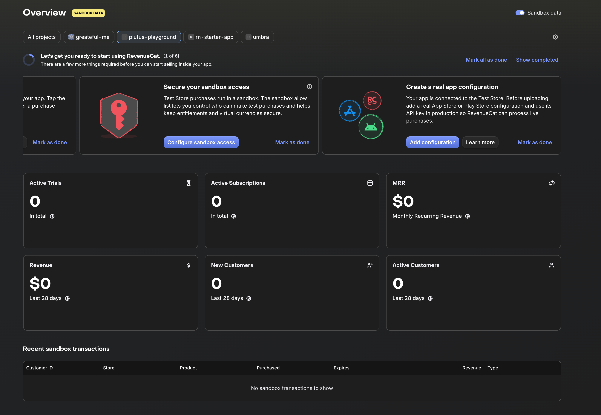

## 3. Connect RevenueCat to App Store Connect

Navigate to the RevenueCat dashboard → Apps & Providers → New App Store app. Enter your app name and the exact bundle ID from your `app.json`.

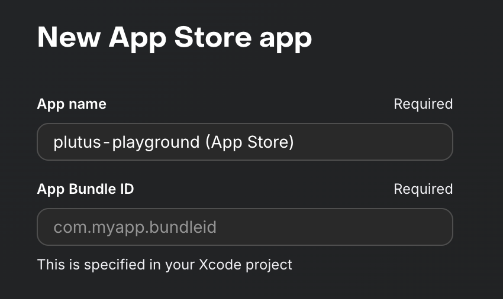

Configure the following critical sections:

- **In-app Purchase Key:** Required for StoreKit 2 transaction recording.
- **App Store Connect API:** Required for product import and price synchronization.

> **Note:** If you have existing apps on the same Apple Developer account and RevenueCat account, you can reuse existing In-app Purchase Keys and App Store Connect API keys.

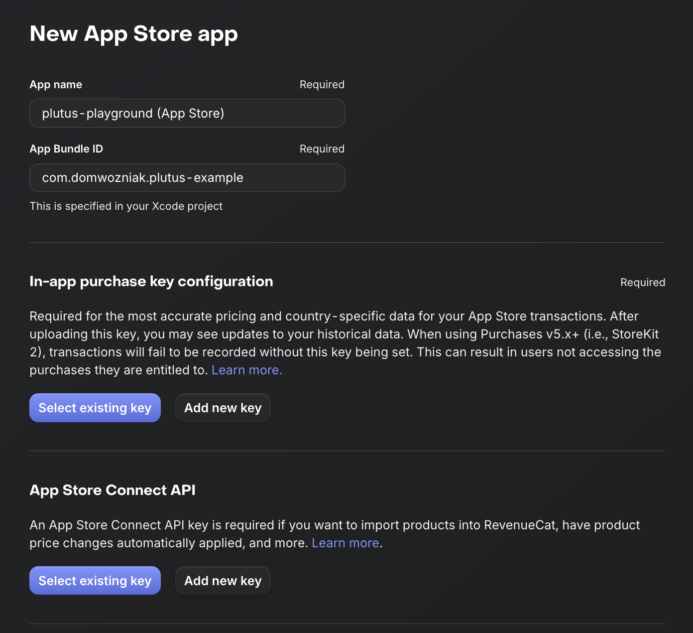

Refer to the [RevenueCat Quickstart](https://www.revenuecat.com/docs/getting-started/quickstart) for guided steps on generating these keys in App Store Connect.

## 4. Configure Apple Server Notifications

In RevenueCat app settings, find the Apple App Store Server Notifications section. Click the **"Apply in App Store Connect"** button for a one-click setup. This automatically configures both Production and Sandbox webhook URLs in App Store Connect under App Information.

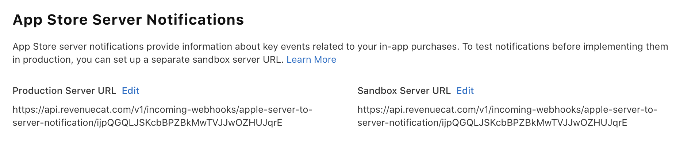

See [Apple Server Notifications](https://www.revenuecat.com/docs/platform-resources/server-notifications/apple-server-notifications) for manual configuration steps if needed.

## 5. Obtain Your API Key

After completing the app setup, find the **Public API Key** in the RevenueCat app settings. This is the production key required by PlutusProvider.

Configure PlutusProvider in your root component with this key and your entitlement name.

```tsx
import { PlutusProvider } from "@byarcadia-app/plutus";

export default function App() {
  return (
    <PlutusProvider
      apiKey={process.env.EXPO_PUBLIC_REVENUECAT_KEY ?? ""}
      entitlementName="pro"
      callbacks={{
        onError: (error) => console.warn("[Plutus Error]", error.code, error.cause),
        onTrackEvent: (name, params) => console.log("[Plutus Event]", name, params),
      }}
    >
      {/* your app */}
    </PlutusProvider>
  );
}
```

> **Note:** The `entitlementName` value is case-sensitive and must exactly match the entitlement identifier created in RevenueCat. The recommended identifier is `pro` (lowercase).

> **Tip:** Store the API key in an environment variable. With EAS, use [EAS Environment Variables](https://docs.expo.dev/eas/environment-variables/) to ensure the key is available in production builds.

See [PlutusProvider](./provider.md) for all configuration options.

## 6. Create Subscription Products in App Store Connect

### Create a Subscription Group

Navigate to App Store Connect → your app → Subscriptions. Create a new subscription group, for example, "Pro". This group contains all your subscription tiers and ensures users can only subscribe to one level at a time.

Refer to [Create an In-App Purchase](https://www.revenuecat.com/docs/getting-started/entitlements/ios-products#create-an-in-app-purchase) for more information.

### Add Subscription Products

Add products to your "Pro" group following the `<appname>_<price>_pro` convention:

- **Monthly:** `myapp_699_pro` (Duration: 1 month)
- **Annual:** `myapp_3499_pro` (Duration: 1 year)
- **Rescue:** `myapp_2499_pro_rescue` (Duration: 1 year)

Reference Name is for your internal identification (e.g., "Monthly Premium").

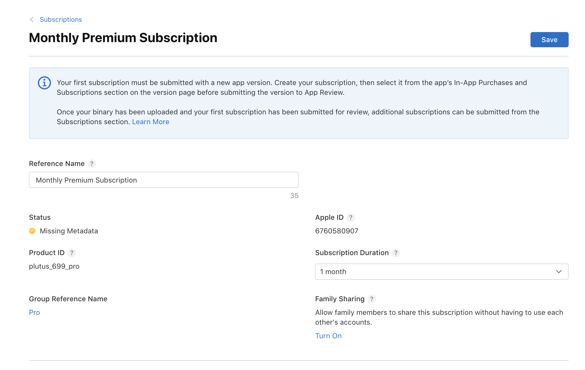

> **Note:** The first subscription submission must accompany a new app version. The "Missing Metadata" status is expected for new products and clears after completing the localization metadata section.

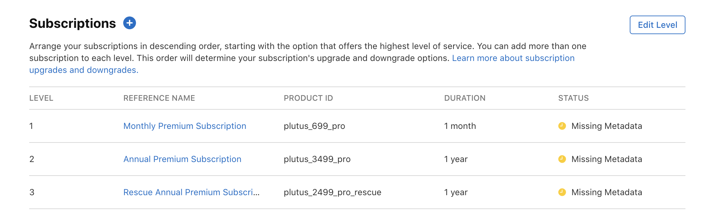

See [iOS Products](https://www.revenuecat.com/docs/getting-started/entitlements/ios-products) for details.

### Set Pricing and Availability

For each product, scroll to Subscription Prices and set the price in USD. Set Availability to all desired countries.

> **Tip:** Prices auto-convert to other currencies, which can result in inflated regional prices. Review and adjust regional prices before launch to match local market conditions.

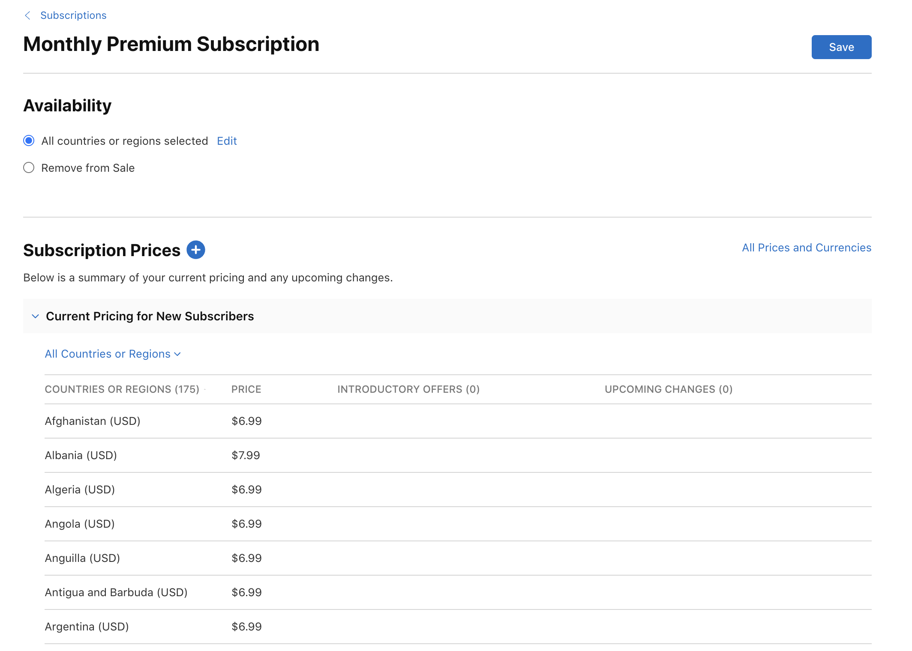

### Add an Introductory Offer (Free Trial)

Open the annual subscription, go to Subscription Prices, click **+**, and select **Create Introductory Offer**.

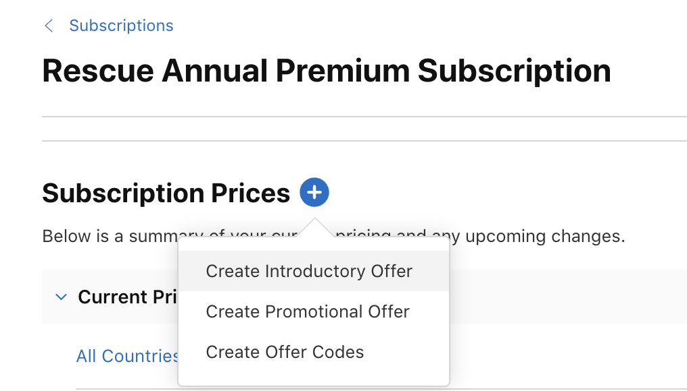

Set the type to **Free** and duration to **1 Week** to offer a free trial to new subscribers.

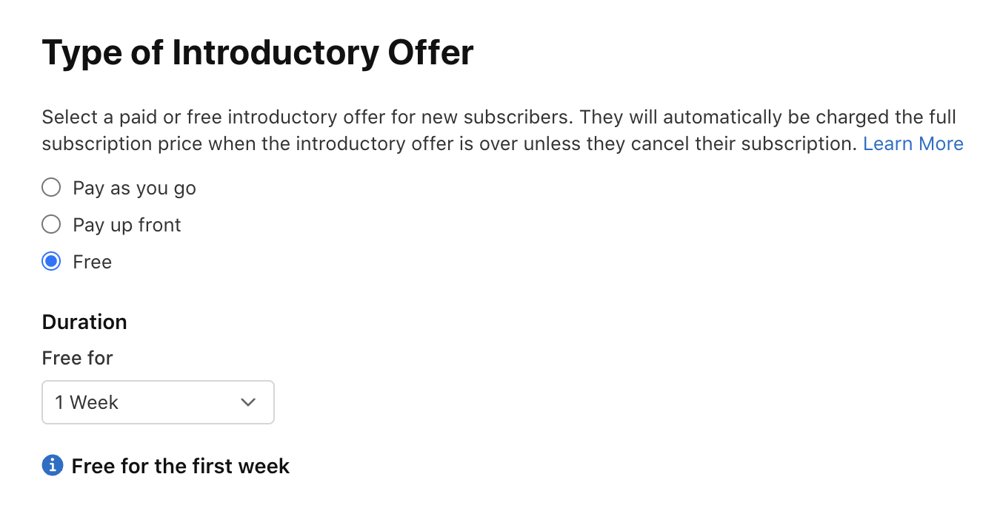

## 7. Configure the RevenueCat Product Catalog

### Import Products from App Store Connect

Navigate to RevenueCat dashboard → Product Catalog → Products → New Product → App Store → **Import Products**. Select all products created in App Store Connect and import them.

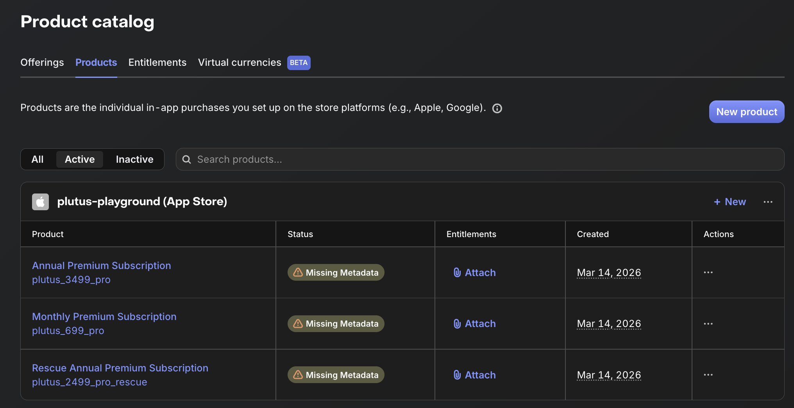

Refer to the [Products Overview](https://www.revenuecat.com/docs/offerings/products-overview) for more details.

### Create an Entitlement

Go to Product Catalog → Entitlements → New Entitlement. Use the identifier **`pro`**.

> **Note:** The entitlement identifier is case-sensitive and must match the `entitlementName` passed to PlutusProvider.

Attach all imported products to this entitlement.

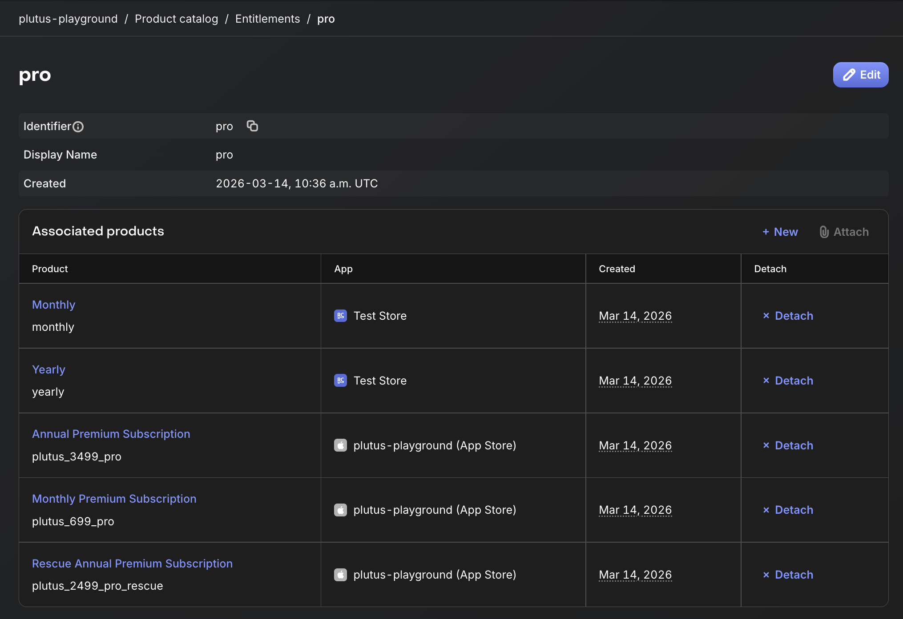

See [Entitlements](https://www.revenuecat.com/docs/getting-started/entitlements) for more information.

### Configure Offerings

**Default offering (identifier: `default`):**
Navigate to Product Catalog → Offerings → default → Edit.

- Assign the Monthly product to the Monthly package (`$rc_monthly`).
- Assign the Annual product to the Annual package (`$rc_annual`).

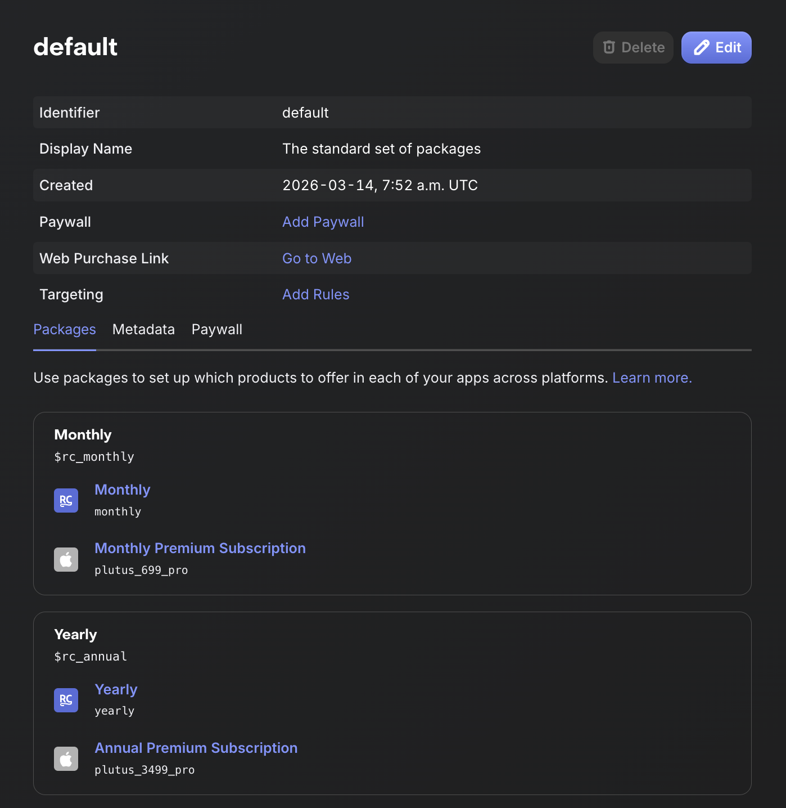

**Rescue offering (identifier: `rescue`):**
Create a new offering with the identifier `rescue`. Add a package and assign the Rescue Annual product. This offering is used by Plutus to present a discount when a user declines the primary offer.

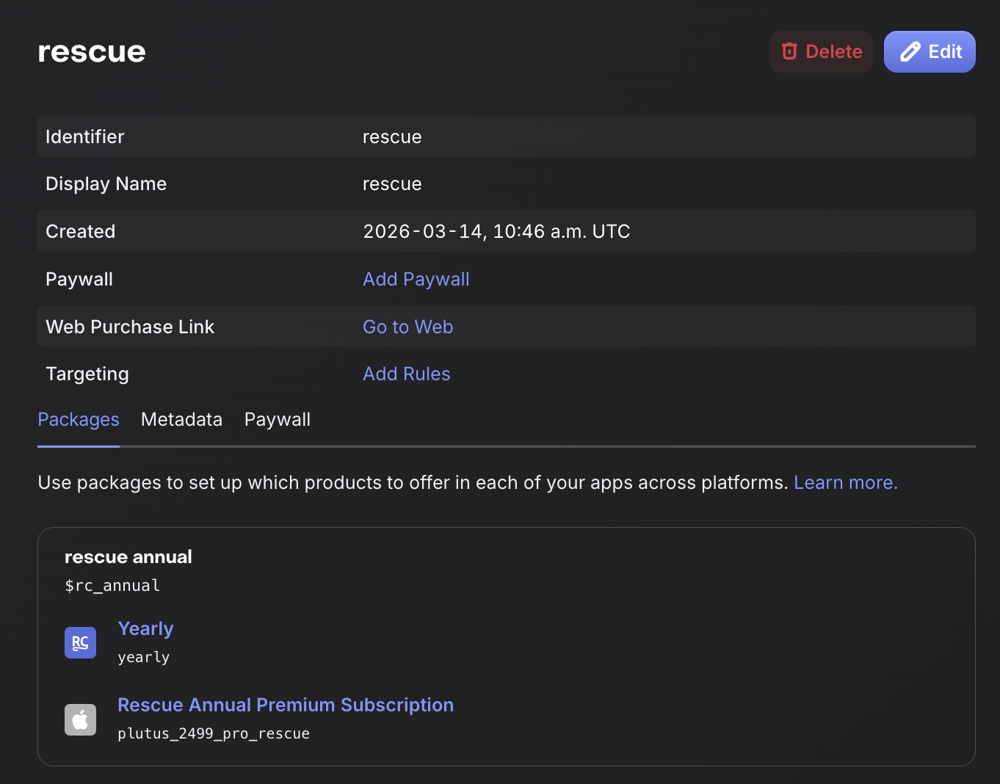

> **Note:** Offering identifiers can be overridden in PlutusProvider via the `offerings` prop. See [PlutusProvider](./provider.md) for details.

## 8. Testing

Use the **test API key** (`test_XXXXXXX`) obtained in step 1 to test your integration without real App Store accounts using the [RevenueCat Test Store](https://www.revenuecat.com/docs/test-store).

For full end-to-end validation on a real device, use Apple's [StoreKit sandbox environment](https://developer.apple.com/documentation/storekit/testing-in-the-sandbox) with a dedicated sandbox Apple ID.

The `example/` app in this repository provides a complete integration for local testing:

```bash
pnpm example:start    # Start Expo dev server
pnpm example:ios      # Run on iOS simulator
```

> **Tip:** With EAS, set your RevenueCat key as a project secret to ensure it is available across all build profiles:

```bash
eas secret:create --scope project --name EXPO_PUBLIC_REVENUECAT_KEY --value your_key_here
```

## Next Steps

With RevenueCat and App Store Connect configured, integrate Plutus into your React Native app:

- [PlutusProvider](./provider.md) — configure callbacks, analytics, and offering identifiers
- [Hooks](./hooks.md) — build your paywall UI with `useOfferings`, `usePaywall`, and `useRescuePaywall`
- [Errors](./errors.md) — handle purchase errors via `onError` callback
